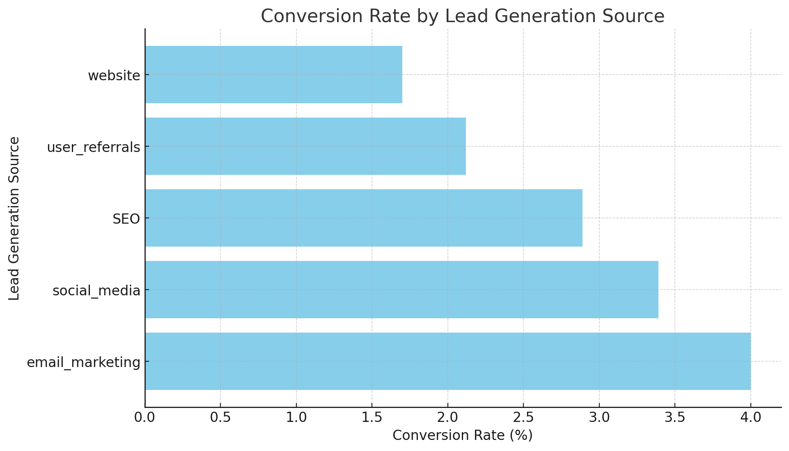
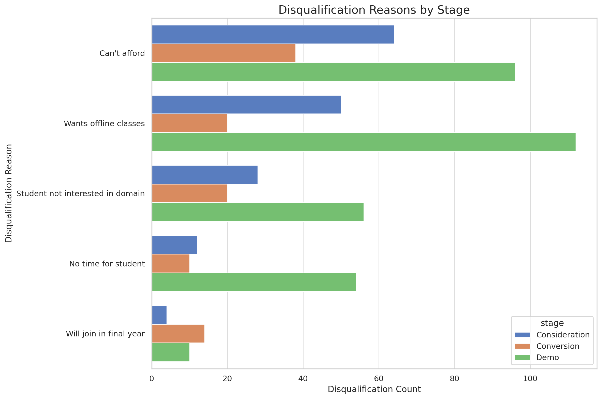

## Introduction

🚀 Explore the world of customer acquisition in the EdTech industry! This project delves into the growth strategies for increasing enrolled users by analyzing key stages of the customer journey, team performance, and pinpointing opportunities for improvement.

🔍 Curious about the SQL queries driving these insights? Find them in the project_sql folder.

## Background

Motivated by the need to boost user enrollment and refine marketing strategies, this project was initiated to uncover actionable insights in customer acquisition. By examining lead progression, team efficiency, and engagement patterns, this analysis aims to provide a clear roadmap for achieving growth targets.

The data powering this project comes from a comprehensive company dataset, offering a deep dive into lead details, sales interactions, demo participation, and more.

**The questions I wanted to answer through my SQL queries were:**

1. What is the conversion rate across different lead generation sources?
2. Which junior sales managers have the highest and lowest call success rates (in terms of lead progressing to the next stage)? 
3. What are the most common reasons leads are not interested in progressing at each stage?
4. Which lead stages have the highest dropout rates?
5. What is the correlation between demo session engagement and conversion rates?

## Tools I Used

For my deep dive into the data analyst job market, I harnessed the power of several key tools:

- **SQL:** The backbone of my analysis, allowing me to query the database and unearth critical insights.
- **PostgreSQL:** The chosen database management system, ideal for handling the job posting data.
- Tableau
- **Visual Studio Code:** My go-to for database management and executing SQL queries.
- **Git & GitHub:** Essential for version control and sharing my SQL scripts and analysis, ensuring collaboration and project tracking.

## The Analysis

Each query for this project aimed at investigating specific aspects of the data analyst job market. Here’s how I approached each question:

1. **What is the conversion rate across different lead generation sources?**

```sql
WITH total_leads AS (
    SELECT 
        lead_gen_source,
        COUNT(*) AS sum_leads_generated
    FROM lead_basic_details
    INNER JOIN leads_interaction_details
        ON lead_basic_details.lead_id = leads_interaction_details.lead_id
    GROUP BY lead_gen_source
),
converted_leads AS (
    SELECT 
        lead_gen_source,
        COUNT(lead_basic_details.lead_id) AS conversion_count
    FROM lead_basic_details
    INNER JOIN leads_interaction_details
        ON lead_basic_details.lead_id = leads_interaction_details.lead_id
    WHERE lead_stage = 'conversion'
    GROUP BY lead_gen_source
)
SELECT 
    total_leads.lead_gen_source,
    converted_leads.conversion_count AS converted_leads,
    total_leads.sum_leads_generated AS total_leads_generated,
    CASE 
        WHEN total_leads.sum_leads_generated > 0 THEN 
            ROUND((converted_leads.conversion_count * 100.0 / total_leads.sum_leads_generated),2)
        ELSE 0
    END AS conversion_rate_percentage
FROM total_leads
LEFT JOIN converted_leads
    ON total_leads.lead_gen_source = converted_leads.lead_gen_source
ORDER BY conversion_rate_percentage DESC;
```


*Bar graph visualizing the conversion rate by lead generation source; ChatGPT generated this graph from my SQL results*

**Key Findings:**

- **Email Marketing** emerged as the most effective lead generation source, with a conversion rate of **4.00%** from 475 total leads, resulting in 19 conversions.
- **Social Media** followed with a conversion rate of **3.39%**, converting 17 out of 501 leads.
- **SEO** had a conversion rate of **2.89%**, generating 14 conversions from 485 leads.
- **User Referrals** showed a conversion rate of **2.12%**, converting 8 out of 378 leads.
- **Website Traffic** had the lowest conversion rate at **1.70%**, with 6 conversions from 353 leads.

Email marketing proved to be the most efficient channel in terms of conversion rates, indicating a higher ROI for efforts in this area. In contrast, the website traffic, while generating a considerable number of leads, had the lowest conversion rate, suggesting a need for optimization in this channel. These insights will guide future marketing strategies, emphasizing the enhancement of higher-performing channels and improving those with lower conversion rates.


2. **Which junior sales managers have the highest and lowest call success rates (in terms of lead progressing to the next stage)?**

```sql
WITH StageCounts AS (
    SELECT 
        jnr_sm_id,
        lead_id,
        COUNT(DISTINCT lead_stage) AS num_stages
    FROM leads_interaction_details
    GROUP BY jnr_sm_id, lead_id
),
Conversions AS (
    SELECT
        jnr_sm_id,
        lead_id,
        CASE
            WHEN num_stages = 1 THEN 0
            WHEN num_stages = 2 THEN 1
            WHEN num_stages = 3 THEN 2
            WHEN num_stages = 4 THEN 3
            ELSE 0
        END AS conversions
    FROM StageCounts
)
SELECT
    jnr_sm_id,
    SUM(conversions) AS total_conversions
FROM Conversions
GROUP BY jnr_sm_id
ORDER BY total_conversions DESC;
```

**Key Findings:**

- JNR1002MG has 35 total conversions to next stage
- JNR1011MG, JNR1007MG, JNR1013MG, JNR1005MG, JNR1009MG had the lowest of 18 conversions.


3. **What are the most common reasons leads are not interested in progressing at each stage?**

```sql
UPDATE leads_reasons_for_no_interest
SET reasons_for_not_interested_in_demo = 'Can''t afford'
WHERE reasons_for_not_interested_in_demo IN ('Cannot afford', 'can’t afford', 'cant afford');

SELECT
    'Demo' AS stage,
    reasons_for_not_interested_in_demo AS disqualification_reason,
    COUNT(*) AS disqualification_count
FROM
    leads_reasons_for_no_interest
WHERE
    reasons_for_not_interested_in_demo IS NOT NULL
GROUP BY
    reasons_for_not_interested_in_demo

UNION ALL

SELECT
    'Consideration' AS stage,
    reasons_for_not_interested_in_consideration AS disqualification_reason,
    COUNT(*) AS disqualification_count
FROM
    leads_reasons_for_no_interest
WHERE
    reasons_for_not_interested_in_consideration IS NOT NULL
GROUP BY
    reasons_for_not_interested_in_consideration

UNION ALL

SELECT
    'Conversion' AS stage,
    reasons_for_not_interested_in_conversion AS disqualification_reason,
    COUNT(*) AS disqualification_count
FROM
    leads_reasons_for_no_interest
WHERE
    reasons_for_not_interested_in_conversion IS NOT NULL
GROUP BY
    reasons_for_not_interested_in_conversion
ORDER BY
    stage, disqualification_count DESC;
```


*Bar graph visualizing disqualification reasons by stages; ChatGPT generated this graph from my SQL results*

The most common reasons for leads not progressing at each stage are as follows:

- **Demo Stage**: The most common reason is *Wants offline classes* with 112 disqualifications, followed by *Can't afford*with 96 disqualifications.
- **Consideration Stage**: The top reason is *Can't afford* with 64 disqualifications, followed by *Wants offline classes*with 50 disqualifications.
- **Conversion Stage**: The most frequent reason is *Can't afford* with 38 disqualifications, followed by *Wants offline classes* with 20 disqualifications.

Across all stages, affordability and a preference for offline classes seem to be the major blockers.


4. **Which lead stages have the highest dropout rates?**

```sql
SELECT 
    COUNT(reasons_for_not_interested_in_consideration) stage_consideration,
    COUNT(reasons_for_not_interested_in_conversion) stage_conversion,
    COUNT(reasons_for_not_interested_in_demo) stage_demo
FROM leads_reasons_for_no_interest;
```

The summary of your data is as follows:

- **Consideration Stage**: 158 leads did not progress.
- **Conversion Stage**: 102 leads did not progress.
- **Demo Stage**: 328 leads did not progress.

This shows that the majority of leads drop off at the Demo stage, followed by the Consideration and Conversion stages.


5. **What is the correlation between demo session engagement and conversion rates?**

```sql
SELECT CORR(watched_percentage, converted) AS correlation_coefficient
FROM (
    SELECT 
        leads.lead_id, 
        demo.watched_percentage,
        MAX(CASE
            WHEN leads.lead_stage = 'conversion' THEN 1
            ELSE 0
        END) AS converted
    FROM leads_interaction_details leads
    LEFT JOIN leads_demo_watched_details demo 
        ON leads.lead_id = demo.lead_id
    WHERE demo.watched_percentage IS NOT NULL
    GROUP BY leads.lead_id, demo.watched_percentage
) AS engagement_data;
```

The correlation analysis between watched_percentage of demo sessions and lead conversion rates resulted in a coefficient of -0.0135. Engagement with demo sessions does not significantly impact lead conversions. 

# What I've learned

Throughout this project, I gained several key insights into customer acquisition strategies, particularly within the EdTech sector. By analyzing lead generation, team performance, and engagement, I was able to extract actionable insights to inform marketing and sales strategies. Here are the most important lessons:

- **Conversion Rate Differences**: The analysis revealed that certain lead generation sources, such as email marketing, had significantly higher conversion rates compared to others, like website traffic. This underlined the importance of focusing on optimizing high-performing channels.

- **Team Performance**: By analyzing the call success rates of junior sales managers, I learned that certain individuals significantly outperformed others in converting leads to the next stage. This emphasized the value of personalized training and support for team members who struggle with conversions.

- **Lead Dropout Insights**: Understanding the reasons for lead disqualification at various stages was particularly insightful. Affordability and the preference for offline classes were the top reasons for disqualification. This information could help tailor future offerings or marketing messages.

- **Demo Engagement and Conversion Correlation**: Surprisingly, there was little correlation between demo engagement (as measured by watched_percentage) and lead conversion rates. This suggests that simply watching more of the demo doesn’t necessarily lead to a higher likelihood of conversion, highlighting the need to reassess the role demos play in the customer journey.

- **Stage Dropout Rates**: The demo stage had the highest dropout rate, followed by the consideration and conversion stages. This suggests that more emphasis should be placed on improving the demo experience or better qualifying leads before offering a demo.

# Conclusions 

- **Focus on Effective Channels**: Prioritize high-performing channels like email marketing and optimize underperforming ones like website traffic to boost conversions.
- **Improve Team Performance**: Provide targeted training to junior sales managers with low conversion rates to raise overall team effectiveness.
- **Address Lead Dropout**: The main reasons for disqualification—affordability and offline preferences—should inform product and marketing adjustments.
- **Reassess Demo Impact**: Since demo engagement showed little correlation with conversions, explore alternative strategies to better engage and qualify leads.
- **Enhance Lead Qualification**: To reduce demo stage dropouts, improve lead qualification before offering demos to focus on high-potential leads.
